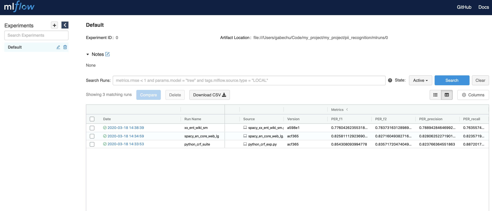

# Personal Identifiable Information (PII) Recognition

## Quick Start

### Example Usage
#### CRF Model
Let's load a pretrained CRF PII recogniser and run the recogniser over an example text.

```python
from tokeniser.tokeniser import nltk_word_tokenizer
from recognisers.crf_recogniser import CrfRecogniser

crf_recogniser = CrfRecogniser(
    supported_entities=[
        "B-LOC", "I-LOC", "B-ORG", "I-ORG",
        "B-PER", "I-PER", "B-MISC", "I-MISC",
    ],
    supported_languages=["en"],
    model_path="exported_models/conll2003-en.crfsuite",  # pretrained model
    tokenizer=nltk_word_tokenizer,  # this crf is token based
)

crf_recogniser.analyse(text="I love Melbourne.", entities=["I-PER", "I-LOC"])
```

This should print (span is used for segment labelling)
```console
[SpanLabel(entity_type='I-LOC', start=7, end=16)]
```


#### spaCy Model
Create a spaCy recogniser and conduct analysis

```python
from recognisers.spacy_recogniser import SpacyRecogniser

spacy_recogniser = SpacyRecogniser(
    supported_entities=["LOC", "MISC", "ORG", "PER"],
    supported_languages=["en", "de", "es", "fr", "it", "pt", "ru"],
    model_name="xx_ent_wiki_sm"  # more models on https://spacy.io/models
)
spacy_recogniser.analyse(text="I love Melbourne.", entities=["PER", "LOC"])
```

This should also print
```console
[SpanLabel(entity_type='LOC', start=7, end=16)]
```


## Recogniser Evaluation
### Data Format
The *input data* to evaluation is a list of strings, where each string represents either a sentence or a paragraph, for example,
```python
input_data = ["A sentence to be evaluated.", "A paragraph to be evaluated."]
```

The label of *ground truth* is defined at a token-level, that is, assigning an entity label to every token in the text, for example, if using a BIO schema ground truths for the above input data are
```python
ground_truths = [["O", "O", "O", "O", "O", "O"], ["O", "O", "O", "O", "O", "O"]]
```

### Evaluator
Evaluation is based on `f-score`. Take one specific recogniser and pass to the evaluator, depending on the value of `f_beta`, `f1` or `f2` values will be produced for each desried entity.
```python
from evaluation.model_evaluator import ModelEvaluator

evaluator = ModelEvaluator(
    recogniser=some_recogniser,
    target_entities=["I-PER"],
    tokeniser=nltk_word_tokenizer  # labels are token based
)

results = evaluator.evaulate_all(input_data, ground_truths)
score = evaluator.calculate_score(results, f_beta=1.)
```
The evaluation produces per entity based results, e.g., `{"PER": 0.7, "LOC": 0.8}`. An aggregation score will be incorporated as an enhancement.

### Performance
Evaluation of experiments are conducted on CONLL 2003 English data. The performance has been logged in `mlflow`. There is a concern raised regarding to the quality of CONLL 2003 that we've been using. I obtained the copy of CONLL data on github, whether github author posted the full dataset is unknown and how the author follows the latest guideline generating the CONLL data is also unknown. Eyeball checking shows that in data many country names are labelled as `I-PER` instead of `I-LOC`, a sentence can contain only one single word with rest to be random numbers. Further evaluation needed to determine if we can trust results getting from CONLL evaluation. Anyhow, here's the unvalidated performance

[](docs/assets/eval_results.png)
